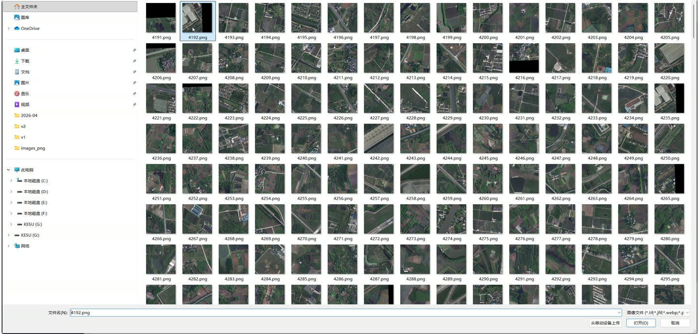
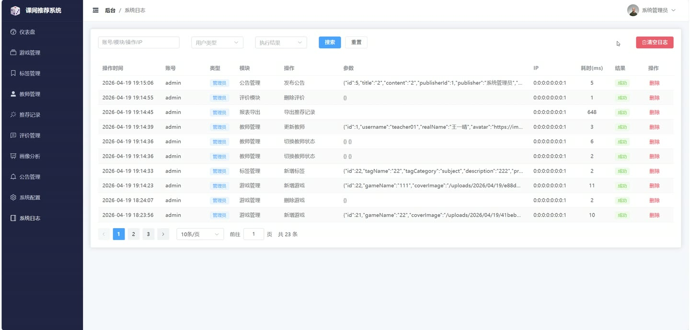
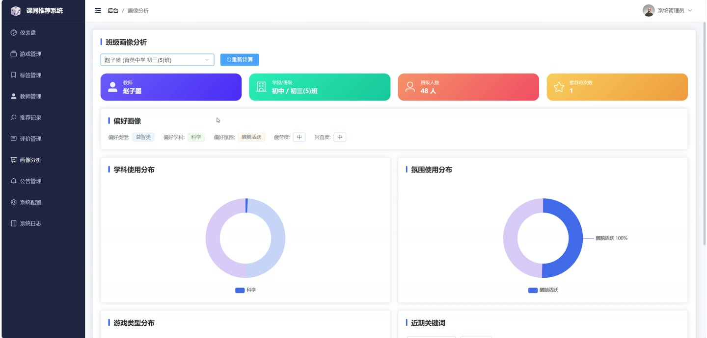

# (附文档)Springboot3+Vue3+MySQL 基于多特征群体画像的课间小游戏智能推荐系统

**技术栈**：Springboot3、Vue3、MySQL

### 系统简介

本系统是一套基于 Springboot3 + Vue3 + MySQL 的课间小游戏智能推荐平台，采用前后端分离架构。系统围绕教师日常课间场景，通过采集班级群体特征（学段、学科、班级类型、天气、时段等），利用多特征画像算法为教师智能推荐最合适的课间小游戏。系统包含管理员端与教师端两大角色，涵盖游戏管理、智能推荐、班级画像、收藏评价、公告发布、报表导出、系统配置及操作日志审计等完整功能闭环。
 
### 核心功能
 
### 教师端

 
- 教师注册与登录（支持账号密码登录，密码 MD5 加密存储） 
- 个人信息管理：查看/修改个人资料、更换头像、修改密码 
- 智能推荐生成：选择知识点、学科、氛围模式、课时段、天气信息，一键生成推荐游戏列表 
- 推荐记录查看：分页浏览个人历史推荐记录，支持按关键词搜索，查看每条推荐的游戏详情 
- 游戏浏览与筛选：按游戏名称、学科、学段、游戏类型、氛围模式、上下架状态进行多条件分页查询 
- 游戏收藏：对感兴趣的游戏进行收藏/取消收藏切换，查看个人收藏列表 
- 游戏评价：对已推荐游戏进行评分（1-5 星）和文字评价，评价后自动更新游戏好评数 
- 班级画像查看：查看系统根据推荐/收藏/评价数据自动生成的班级群体画像（含偏好游戏类型、偏好学科、疲劳度、兴奋度等维度） 
- 公告查看：浏览管理员发布的系统公告列表，查看公告详情 
- 首页聚合：查看热门游戏推荐、最新公告、轮播图及实时天气信息 
- 推荐记录导出：将个人推荐记录导出为 Excel 文件（含教师名、知识点、推荐游戏等字段）
 
### 管理员端

 
- 管理员登录与个人信息管理：登录、查看/修改资料、修改密码 
- 管理员账号管理：新增、删除、分页查询管理员账号，支持按用户名/姓名模糊搜索 
- 教师管理：分页查询教师列表（支持按学段、状态筛选），新增/编辑/删除教师，切换教师启用/禁用状态，重置教师密码 
- 游戏管理：新增/编辑/删除游戏，切换游戏上下架状态，设置游戏属性（名称、封面、玩法、时长、学科、学段、天气适配、氛围模式、游戏类型、场地、关键词、优先级等） 
- 游戏标签管理：新增/编辑/删除游戏标签，按分类筛选标签列表 
- 公告管理：发布/编辑/删除系统公告，设置公告标题、内容、发布状态及发布时间 
- 系统配置管理：查看所有系统配置项，按配置键查询，新增/编辑/删除配置，支持批量更新配置 
- 操作日志管理：分页查看系统操作日志（支持按关键词、用户类型、操作结果筛选），删除单条日志，一键清空所有日志 
- 数据统计仪表盘：查看概要统计卡片（总游戏数、教师数、推荐次数等），近 7 天推荐趋势图，学科分布统计，游戏类型分布，热门游戏排行，教师活跃度排行 
- 报表导出：导出游戏列表 Excel、教师列表 Excel、全部推荐记录 Excel 
- 班级画像管理：查看任意教师的班级画像详情，手动触发画像重新计算 
- 评价管理：查看所有教师对游戏的评价列表，支持按教师/游戏筛选，删除评价
 
### 技术栈

 后端框架Spring Boot 3 ORMMyBatis-Plus 权限认证JWT（jjwt） 前端框架Vue 3 状态管理Pinia 构建工具Vite 数据库MySQL 工具库Hutool、Lombok 报表导出Apache POI 文件上传本地文件存储
 
### 交付内容

 
- 后端完整源码 
- 前端完整源码 
- 数据库初始化脚本 
- 万字文档

## 界面展示

---

## 获取完整源码 + 万字文档

本仓库为项目介绍页。**完整前后端源码、数据库初始化脚本、万字项目文档**，请加微信 `kangkangcode`，或访问 [codekk.top](http://codekk.top) 获取。

可作课程设计 / 毕业设计参考，支持远程部署调试。